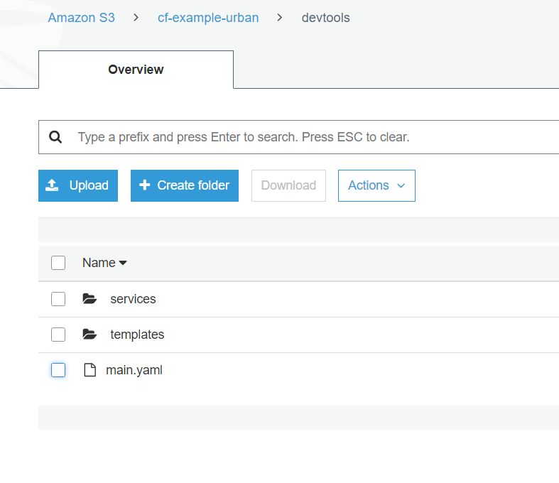
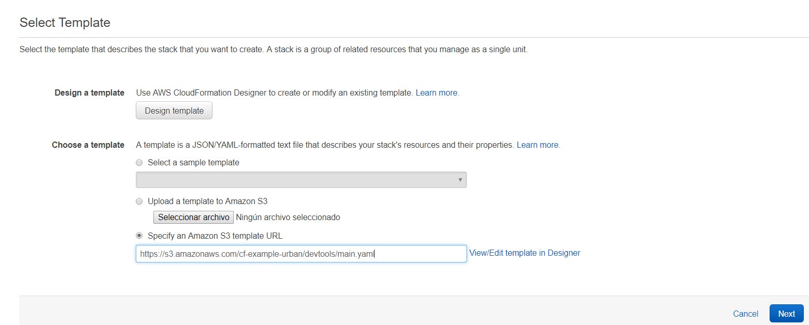

# DevTools in AWS

Deploy tools like Jenkins, SonarQube and Nexus in an ECS cluster.

## Architecture


## Get Started

```sh
git clone https://github.com/HernanUrban/devtools-aws.git
```

### Pre-Requisites
- You need a [Key-Pair](https://docs.aws.amazon.com/AWSEC2/latest/UserGuide/ec2-key-pairs.html) pem created in order to connect to the bastion if needed.
- An [S3 bucket](https://docs.aws.amazon.com/AmazonS3/latest/user-guide/create-bucket.html) in order to upload the templates.  
  

### 1st Create the empty Cluster
- Go to Cloudformation, select create new stack and use the S3 url to point the main.yaml template.
  

- Fill the form. You can select an existing EFS if already created. Otherwise just leave it empty and it will be created for you.
- You need at least two Availability Zone.
- Copy/paste the URL of the S3 bucket in order to indicate the base path for the nested templates. (Is the base path where the main.yaml file is).

## 2nd Create the Tools
- After Cluster is created you need to create the tool that you need.
- Go to Cloudformation, select create new stack and use the S3 url to point to the Jenkins.yaml (is inside the services folder).
- As before, fill the form.
- In the ELBSecurityGroup section you must select the SecurityGroup of the Load Balancer created with the previous template.
- You must type the cluster name, which can be found in the ECS section. (it should be "project name"-"environment", it is case sensitive).

For Nexus and sonarQube repeat the 2nd changing the template.

In the Outputs you will find the Load Balancer DNS which is what you need to start using the tool.


